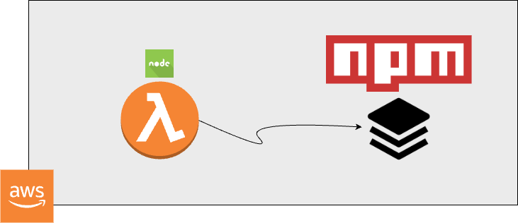

# Today I learnt

Date: 03/10/2024

### JSON ignores `undefined` in Stringify

When using JSON.stringify() in JavaScript, properties with undefined values are ignored. This means they won't appear in the resulting JSON string.

```javascript
const obj = {
  a: 1,
  b: undefined,
  c: 3,
};

const jsonString = JSON.stringify(obj);
console.log(jsonString); // Output: {"a":1,"c":3}
```

In this example, the property b is not included in the JSON string because its value is undefined.

### Reason for above behavior in JSON

JSON.stringify() ignores undefined values because JSON, as a data interchange format, does not have a representation for undefined. JSON is designed to be a language-independent format, and not all languages have an equivalent to JavaScript's undefined. By omitting these values, JSON.stringify() ensures that the resulting JSON is valid and can be correctly interpreted by systems that consume it.

This behavior also helps in minimizing the size of the JSON data by excluding unnecessary information.

### How to handle such cases?

To handle undefined values in JSON.stringify(), you can use a replacer function or preprocess the object to convert undefined values to null or another placeholder.

You can pass a replacer function as the second argument to JSON.stringify(). This function can transform undefined values to null or another desired value.

```javascript
const obj = {
  a: 1,
  b: undefined,
  c: 3,
};

const jsonString = JSON.stringify(obj, (key, value) =>
  value === undefined ? null : value
);

console.log(jsonString); // Output: {"a":1,"b":null,"c":3}
```

## 
